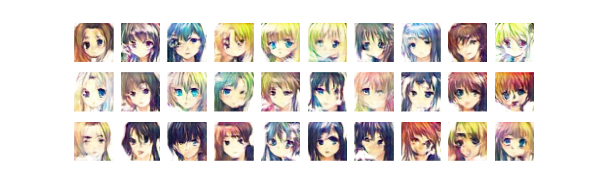

# Automatic Anime Characters Creation with Wasseirstein GAN with gradient penalty (WGAN-GP)
This is a project that aims to automatically create anime characters using Generative Adversarial Networks (GANs). The project is based on the paper "Towards the Automatic Anime Characters Creation with Generative Adversarial Networks" by Takuhiro Kaneko, which can be found [here](https://arxiv.org/pdf/1708.05509.pdf).

## Generative Adversarial Networks (GANs)
GANs are a type of neural network that consists of two parts: a generator and a discriminator. The generator creates new data that is similar to a training set, while the discriminator tries to distinguish between the generated data and the real data. The two parts are trained simultaneously, with the generator trying to fool the discriminator and the discriminator trying to correctly identify the real data.

## Anime Character Dataset
The dataset used in this project is the Anime Face Dataset, which consists of over 63,000 anime face images. The dataset can be found [here](https://www.kaggle.com/datasets/splcher/animefacedataset).

## Project Structure
The project is structured as follows:
- **data/**: Contains the dataset. Data is available on kaggle.
- **models/**: Contains the GAN models implemented in the project.  
         - **dcgan/**: Deep convolution GAN implementation  
         - **wgangp/**: Wasserstein GAN with gradient penalty  
- **functions/**: Contains utility functions such as data reading
- **anime-character-generation.ipynb**: Notebook containing code to train gan on anime characters dataset

## GAN Architechtures ordered by date of release
**Vanilla GAN (2014)**: The original GAN proposed by Ian Goodfellow is a basic architecture consisting of a generator and a discriminator.  
**DCGAN (2015)**: Deep Convolutional GAN (DCGAN) is an extension of the original GAN architecture, which uses convolutional layers to enable the generation of high-resolution images.  
**Pix2Pix (2017)**: Pix2Pix is a conditional GAN that can be used for image-to-image translation tasks, such as converting sketches to realistic images.  
**CycleGAN (2017)**: CycleGAN is an unsupervised GAN that can be used for image-to-image translation tasks without the need for paired training data.  
**WGAN (2017)**: Wasserstein GAN (WGAN) is a modification of the GAN training process that improves stability and encourages smoother training.  
**WGAN-GP (2017)**: WGAN-GP (Wasserstein GAN with Gradient Penalty) is another variant of the original GAN architecture that uses a gradient penalty instead of weight clipping to enforce the Wasserstein distance constraint. WGAN-GP has been shown to be more stable than WGAN and can generate higher quality images.  
**ProgressiveGAN (2017)**: ProgressiveGAN is an architecture that starts with a low-resolution generator and discriminator and gradually adds layers to increase the image resolution. This approach allows for the generation of high-resolution images with fewer training iterations and has been shown to produce state-of-the-art results on several image generation tasks.  
**StyleGAN (2018)**: StyleGAN uses a style-based generator architecture that allows for fine-grained control over the generated images' style and attributes.  
**BigGAN (2018)**: BigGAN is a large-scale GAN architecture that can generate high-resolution images with improved quality and diversity.  

This reporisoty aims to create reproducible code for DCGAN and WGAN-GP applied on anime character generation. In future projects, I will be implementing and using ProgressiveGAN and StyleGAN so **STAY TUNED**!  

## WGAN-GP current results (10 epochs, 2.6 million parameters)

 

## WGAN-GP and its limitations
Wasserstein Generative Adversarial Networks (WGAN) with gradient penalty (WGAN-GP) is a popular variant of GANs that addresses some of the issues in traditional GANs such as mode collapse and training instability. However, WGAN-GP also has some limitations, including:

- **Computational Resources**: WGAN-GP can be computationally expensive, especially for high-resolution images. Training the generator and discriminator can require significant computing power and take a long time to converge.

- **Sensitivity to Hyperparameters**: WGAN-GP has several hyperparameters that need to be carefully tuned for optimal performance. If the hyperparameters are not set correctly, the model may fail to converge, or the generated images may be of poor quality.

- **Limited Diversity**: WGAN-GP can generate high-quality images, but it may struggle to produce diverse images, especially for complex datasets. This is because the generator may focus on replicating a few patterns in the training data rather than exploring the full range of possible images.

- **Quality of Generated Images**: While WGAN-GP can generate realistic images, the quality of the generated images may still fall short of human-level perception. The generated images may have artifacts or lack fine details, making them less realistic than real-world images.

- **Mode Collapse**: WGAN-GP can still suffer from mode collapse, where the generator produces only a few modes of the target distribution rather than a diverse set of outputs. This can result in the generator producing repetitive or identical images.

## References
[[1]](https://arxiv.org/pdf/1708.05509.pdf) Kaneko, T. (2017). Towards the Automatic Anime Characters Creation with Generative Adversarial Networks.   
[[2]](https://arxiv.org/abs/1406.2661) Goodfellow, Ian, et al. "Generative Adversarial Networks." arXiv preprint arXiv:1406.2661 (2014)   
[[3]](https://arxiv.org/abs/1511.06434) Radford, Alec, et al. "Unsupervised Representation Learning with Deep Convolutional Generative Adversarial Networks." arXiv preprint arXiv:1511.06434 (2015)   
[[4]](https://arxiv.org/abs/1701.07875) Arjovsky, Martin, et al. "Wasserstein Generative Adversarial Networks." arXiv preprint arXiv:1701.07875 (2017)   
[[5]](https://arxiv.org/abs/1701.07875) Arjovsky, M., Chintala, S., & Bottou, L. (2017). Wasserstein GAN. arXiv preprint arXiv:1701.07875.  
[[6]](https://www.kaggle.com/splcher/animefacedataset) Anime Face Dataset.    
